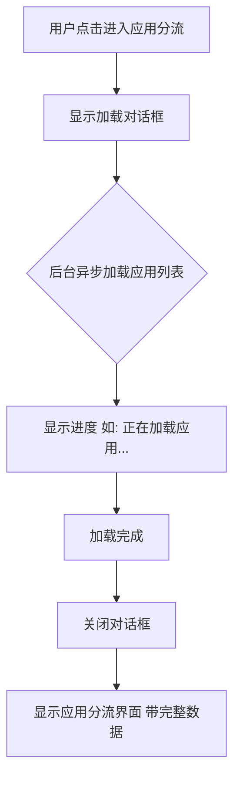
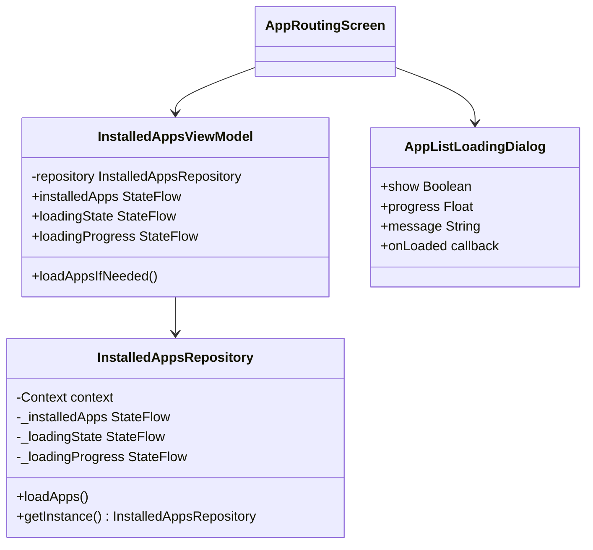

# 应用列表加载优化计划

## 问题分析

### 现状
当用户进入"应用分流"相关屏幕时，会出现约1.8秒的UI卡顿，期间有大量 `AssetManager2 locale list changing` 日志。

### 根本原因
1. 系统需要加载所有已安装应用（通常有100-300个）
2. 对每个应用调用 `loadLabel(pm)` 会触发资源加载
3. 虽然使用了 `Dispatchers.IO`，但 AssetManager 的资源访问仍会影响主线程
4. 日志显示的 `Davey! duration=1826ms` 表明主线程被阻塞

### 受影响的文件

| 文件 | 问题代码位置 | 说明 |
|------|-------------|------|
| [`AppRoutingScreen.kt`](../app/src/main/java/com/kunk/singbox/ui/screens/AppRoutingScreen.kt:61-77) | `LaunchedEffect(Unit)` | 屏幕进入时加载应用列表 |
| [`AppGroupsScreen.kt`](../app/src/main/java/com/kunk/singbox/ui/screens/AppGroupsScreen.kt:52-68) | `LaunchedEffect(Unit)` | 屏幕进入时加载应用列表 |
| [`AppRulesScreen.kt`](../app/src/main/java/com/kunk/singbox/ui/screens/AppRulesScreen.kt:57-73) | `LaunchedEffect(Unit)` | 屏幕进入时加载应用列表 |
| [`CommonDialogs.kt`](../app/src/main/java/com/kunk/singbox/ui/components/CommonDialogs.kt:238-254) | `AppMultiSelectDialog` | 对话框中使用 `remember` 同步加载 |

## 解决方案

### 方案核心思想
**先显示加载对话框，在对话框中异步加载应用列表，加载完成后再显示实际内容。**

### 用户体验流程



### 架构设计



## 实施步骤

### 步骤 1: 创建 InstalledAppsRepository

**文件**: `app/src/main/java/com/kunk/singbox/repository/InstalledAppsRepository.kt`

功能：
- 单例模式，避免重复加载
- 使用 `StateFlow` 暴露加载状态和进度
- 支持进度回调（已加载 X / 总共 Y 个应用）
- 缓存机制，避免重复加载

### 步骤 2: 创建 InstalledAppsViewModel

**文件**: `app/src/main/java/com/kunk/singbox/viewmodel/InstalledAppsViewModel.kt`

功能：
- 封装 Repository 的访问
- 提供 `loadAppsIfNeeded()` 方法
- 管理加载状态

### 步骤 3: 创建加载对话框组件

**文件**: `app/src/main/java/com/kunk/singbox/ui/components/AppListLoadingDialog.kt`

UI设计：
```
┌─────────────────────────────────┐
│                                 │
│     [旋转加载图标或进度环]       │
│                                 │
│      正在加载应用列表...         │
│                                 │
│      已加载 45 / 128 个应用     │
│                                 │
│     ════════════════════        │
│           [进度条]               │
│                                 │
└─────────────────────────────────┘
```

### 步骤 4-7: 修改各个屏幕

修改思路：
1. 移除 `LaunchedEffect` 中的加载逻辑
2. 使用 `InstalledAppsViewModel`
3. 在数据未加载完成时显示加载对话框
4. 加载完成后自动切换到正常界面

### 步骤 8: 修改 AppMultiSelectDialog

将同步加载改为异步加载，或者复用 Repository 的缓存数据。

## 关键代码示例

### InstalledAppsRepository 核心实现

```kotlin
class InstalledAppsRepository private constructor(private val context: Context) {
    
    sealed class LoadingState {
        object Idle : LoadingState()
        data class Loading(val progress: Float, val current: Int, val total: Int) : LoadingState()
        object Loaded : LoadingState()
        data class Error(val message: String) : LoadingState()
    }
    
    private val _installedApps = MutableStateFlow<List<InstalledApp>>(emptyList())
    val installedApps: StateFlow<List<InstalledApp>> = _installedApps.asStateFlow()
    
    private val _loadingState = MutableStateFlow<LoadingState>(LoadingState.Idle)
    val loadingState: StateFlow<LoadingState> = _loadingState.asStateFlow()
    
    suspend fun loadApps() {
        if (_loadingState.value is LoadingState.Loaded) return
        if (_loadingState.value is LoadingState.Loading) return
        
        withContext(Dispatchers.IO) {
            val pm = context.packageManager
            val allApps = pm.getInstalledApplications(PackageManager.GET_META_DATA)
                .filter { it.packageName != context.packageName }
            
            val total = allApps.size
            val result = mutableListOf<InstalledApp>()
            
            allApps.forEachIndexed { index, app ->
                _loadingState.value = LoadingState.Loading(
                    progress = (index + 1).toFloat() / total,
                    current = index + 1,
                    total = total
                )
                
                result.add(InstalledApp(
                    packageName = app.packageName,
                    appName = app.loadLabel(pm).toString(),
                    isSystemApp = (app.flags and ApplicationInfo.FLAG_SYSTEM) != 0
                ))
            }
            
            _installedApps.value = result.sortedBy { it.appName.lowercase() }
            _loadingState.value = LoadingState.Loaded
        }
    }
    
    companion object {
        @Volatile
        private var instance: InstalledAppsRepository? = null
        
        fun getInstance(context: Context): InstalledAppsRepository {
            return instance ?: synchronized(this) {
                instance ?: InstalledAppsRepository(context.applicationContext).also {
                    instance = it
                }
            }
        }
    }
}
```

### AppListLoadingDialog 组件

```kotlin
@Composable
fun AppListLoadingDialog(
    loadingState: InstalledAppsRepository.LoadingState,
    onDismissRequest: () -> Unit = {}
) {
    if (loadingState !is InstalledAppsRepository.LoadingState.Loading) return
    
    Dialog(onDismissRequest = onDismissRequest) {
        Column(
            modifier = Modifier
                .fillMaxWidth()
                .background(SurfaceCard, RoundedCornerShape(28.dp))
                .padding(24.dp),
            horizontalAlignment = Alignment.CenterHorizontally
        ) {
            CircularProgressIndicator(
                progress = loadingState.progress,
                color = PureWhite,
                modifier = Modifier.size(64.dp)
            )
            
            Spacer(modifier = Modifier.height(16.dp))
            
            Text(
                text = "正在加载应用列表...",
                style = MaterialTheme.typography.titleMedium,
                color = TextPrimary
            )
            
            Spacer(modifier = Modifier.height(8.dp))
            
            Text(
                text = "已加载 ${loadingState.current} / ${loadingState.total} 个应用",
                style = MaterialTheme.typography.bodyMedium,
                color = TextSecondary
            )
            
            Spacer(modifier = Modifier.height(16.dp))
            
            LinearProgressIndicator(
                progress = loadingState.progress,
                modifier = Modifier.fillMaxWidth(),
                color = PureWhite,
                trackColor = Divider
            )
        }
    }
}
```

### 修改后的 AppRoutingScreen 示例

```kotlin
@Composable
fun AppRoutingScreen(
    navController: NavController,
    settingsViewModel: SettingsViewModel = viewModel(),
    nodesViewModel: NodesViewModel = viewModel(),
    profilesViewModel: ProfilesViewModel = viewModel()
) {
    val context = LocalContext.current
    val installedAppsRepository = remember { InstalledAppsRepository.getInstance(context) }
    
    val installedApps by installedAppsRepository.installedApps.collectAsState()
    val loadingState by installedAppsRepository.loadingState.collectAsState()
    
    // 触发加载
    LaunchedEffect(Unit) {
        installedAppsRepository.loadApps()
    }
    
    // 显示加载对话框
    AppListLoadingDialog(loadingState = loadingState)
    
    // 主界面内容 - 当加载完成时显示
    if (loadingState is InstalledAppsRepository.LoadingState.Loaded) {
        // ... 原有的 Scaffold 和内容
    }
}
```

## 优势

1. **用户体验优化**: 明确的加载进度反馈，用户知道正在发生什么
2. **性能提升**: 使用单例缓存，后续访问无需重新加载
3. **代码复用**: 所有需要应用列表的地方都可以复用 Repository
4. **可维护性**: 集中管理加载逻辑，便于后续优化

## 风险和注意事项

1. **缓存刷新**: 需要考虑用户安装/卸载应用后刷新缓存
2. **内存占用**: 应用列表会占用一定内存，但相比用户体验提升是值得的
3. **首次加载**: 首次进入仍需等待，但后续访问会很快

## 后续优化建议

1. 考虑在应用启动时预加载应用列表
2. 添加下拉刷新功能以重新加载应用列表
3. 考虑分页加载超大量应用的场景