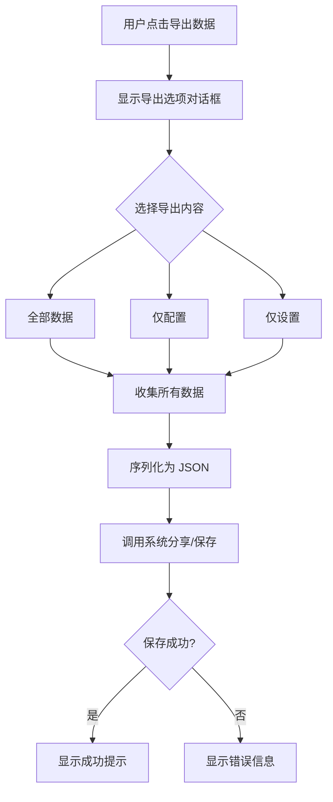
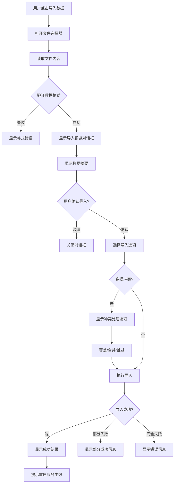

# 导入导出数据功能设计方案

## 1. 功能概述

实现应用数据的导入导出功能，方便用户在切换设备时迁移数据。导出的数据将包含所有用户配置、订阅信息、节点数据和自定义规则。

## 2. 需要导入导出的数据

### 2.1 应用设置 (AppSettings)
- 通用设置：自动连接、自动重连、主题等
- TUN/VPN 设置：堆栈类型、MTU、分应用代理等
- DNS 设置：本地/远程DNS、FakeDNS、DNS策略等
- 路由设置：路由模式、默认规则、广告拦截等
- 代理端口设置：端口号、局域网访问等
- 延迟测试设置：测试方法、测试URL
- 镜像设置：GitHub代理镜像选择
- 自定义规则：customRules
- 规则集配置：ruleSets
- 应用分流规则：appRules、appGroups
- 规则集自动更新设置

### 2.2 配置和节点数据
- 配置列表 (ProfileUi)：订阅信息、配置类型、更新时间等
- 节点配置文件 (SingBoxConfig JSON)：每个配置的完整节点数据
- 活跃配置 ID
- 活跃节点 ID

## 3. 技术方案

### 3.1 数据模型设计

```kotlin
// 导出数据的根模型
data class ExportData(
    val version: Int = 1,                    // 数据格式版本号
    val exportTime: Long,                    // 导出时间戳
    val appVersion: String,                  // 应用版本号
    val settings: AppSettings,               // 应用设置
    val profiles: List<ProfileExportData>,   // 配置列表
    val activeProfileId: String?,            // 活跃配置 ID
    val activeNodeId: String?                // 活跃节点 ID
)

// 配置导出数据
data class ProfileExportData(
    val profile: ProfileUi,                  // 配置元数据
    val config: SingBoxConfig                // 完整的节点配置
)
```

### 3.2 新增文件

1. **`model/ExportData.kt`** - 导出数据模型
2. **`repository/DataExportRepository.kt`** - 导入导出逻辑
3. **`ui/components/ExportImportDialogs.kt`** - 对话框组件

### 3.3 修改文件

1. **`viewmodel/SettingsViewModel.kt`** - 添加导入导出方法
2. **`ui/screens/SettingsScreen.kt`** - 添加UI入口
3. **`repository/SettingsRepository.kt`** - 添加批量导入设置方法
4. **`repository/ConfigRepository.kt`** - 添加批量导入配置方法

## 4. 详细设计

### 4.1 DataExportRepository

```kotlin
class DataExportRepository(private val context: Context) {
    
    private val gson = Gson()
    private val settingsRepository = SettingsRepository.getInstance(context)
    private val configRepository = ConfigRepository.getInstance(context)
    
    /**
     * 导出所有数据
     * @return 导出数据的 JSON 字符串
     */
    suspend fun exportAllData(): Result<String>
    
    /**
     * 导入数据
     * @param jsonData 导入的 JSON 字符串
     * @param options 导入选项（覆盖/合并）
     * @return 导入结果
     */
    suspend fun importData(jsonData: String, options: ImportOptions): Result<ImportResult>
    
    /**
     * 导出到文件
     */
    suspend fun exportToFile(uri: Uri): Result<Unit>
    
    /**
     * 从文件导入
     */
    suspend fun importFromFile(uri: Uri, options: ImportOptions): Result<ImportResult>
    
    /**
     * 验证导入数据
     */
    suspend fun validateImportData(jsonData: String): Result<ExportData>
}

data class ImportOptions(
    val overwriteExisting: Boolean = false,    // 是否覆盖现有数据
    val importSettings: Boolean = true,        // 是否导入设置
    val importProfiles: Boolean = true,        // 是否导入配置
    val importRules: Boolean = true            // 是否导入规则
)

sealed class ImportResult {
    data class Success(
        val profilesImported: Int,
        val nodesImported: Int,
        val settingsImported: Boolean
    ) : ImportResult()
    
    data class PartialSuccess(
        val profilesImported: Int,
        val profilesFailed: Int,
        val errors: List<String>
    ) : ImportResult()
    
    data class Failed(val error: String) : ImportResult()
}
```

### 4.2 UI 设计

在设置页面的「工具」分组中添加两个入口：

```
┌────────────────────────────────────────┐
│ 工具                                    │
├────────────────────────────────────────┤
│ 📤 导出数据                             │
│    备份所有配置和设置到文件              │
├────────────────────────────────────────┤
│ 📥 导入数据                             │
│    从备份文件恢复配置和设置              │
└────────────────────────────────────────┘
```

### 4.3 导出流程



### 4.4 导入流程



### 4.5 导出文件格式

```json
{
  "version": 1,
  "exportTime": 1735904417000,
  "appVersion": "1.0.0",
  "settings": {
    "autoConnect": false,
    "autoReconnect": true,
    "appTheme": "SYSTEM",
    "tunEnabled": true,
    "tunStack": "SYSTEM",
    "tunMtu": 9000,
    "localDns": "223.5.5.5",
    "remoteDns": "1.1.1.1",
    "fakeDnsEnabled": true,
    "routingMode": "RULE",
    "defaultRule": "PROXY",
    "blockAds": true,
    "customRules": [...],
    "ruleSets": [...],
    "appRules": [...],
    "appGroups": [...]
  },
  "profiles": [
    {
      "profile": {
        "id": "uuid-1",
        "name": "我的订阅",
        "type": "Subscription",
        "url": "https://example.com/sub",
        "lastUpdated": 1735904400000,
        "enabled": true,
        "autoUpdateInterval": 60
      },
      "config": {
        "outbounds": [...]
      }
    }
  ],
  "activeProfileId": "uuid-1",
  "activeNodeId": "node-uuid-1"
}
```

## 5. 实现步骤

### 步骤 1: 创建数据模型
- 创建 `ExportData.kt` 定义导出数据结构
- 支持版本号以便未来数据迁移

### 步骤 2: 实现 DataExportRepository
- 导出功能：收集设置和配置数据，序列化为 JSON
- 导入功能：解析 JSON，验证数据，写入存储
- 支持部分导入和错误处理

### 步骤 3: 更新 SettingsRepository
- 添加 `importSettings(settings: AppSettings)` 方法
- 支持批量更新所有设置项

### 步骤 4: 更新 ConfigRepository
- 添加 `importProfiles(profiles: List<ProfileExportData>)` 方法
- 处理配置文件的保存和缓存更新

### 步骤 5: 更新 SettingsViewModel
- 添加 `exportData()` 方法
- 添加 `importData(uri: Uri)` 方法
- 添加导入导出状态管理

### 步骤 6: 创建 UI 组件
- `ExportDialog`: 导出选项对话框
- `ImportPreviewDialog`: 导入预览对话框
- `ImportProgressDialog`: 导入进度对话框

### 步骤 7: 更新 SettingsScreen
- 添加导出数据入口
- 添加导入数据入口
- 集成文件选择器

### 步骤 8: 添加文件操作
- 使用 `ActivityResultContracts.CreateDocument` 保存文件到本地
- 使用 `ActivityResultContracts.OpenDocument` 打开文件

## 6. 注意事项

### 6.1 数据安全
- 导出文件可能包含敏感信息（节点密码、UUID等）
- 提示用户妥善保管导出文件
- 当前版本不加密，仅保存本地

### 6.2 版本兼容
- 使用版本号标识数据格式
- 导入时检查版本并进行必要的迁移
- 低版本应用无法导入高版本数据

### 6.3 数据完整性
- 导入前验证 JSON 格式和必要字段
- 处理缺失字段时使用默认值
- 记录并报告导入失败的项目

### 6.4 用户体验
- 导出完成后显示文件保存位置
- 导入前显示数据摘要让用户确认
- 导入后提示是否需要重启服务

### 6.5 冲突处理策略
- 配置名称冲突时默认覆盖现有数据
- 设置项全部覆盖，不支持合并

## 7. 文件清单

### 新增文件
- `app/src/main/java/com/kunk/singbox/model/ExportData.kt`
- `app/src/main/java/com/kunk/singbox/repository/DataExportRepository.kt`
- `app/src/main/java/com/kunk/singbox/ui/components/ExportImportDialogs.kt`

### 修改文件
- `app/src/main/java/com/kunk/singbox/viewmodel/SettingsViewModel.kt`
- `app/src/main/java/com/kunk/singbox/ui/screens/SettingsScreen.kt`
- `app/src/main/java/com/kunk/singbox/repository/SettingsRepository.kt`
- `app/src/main/java/com/kunk/singbox/repository/ConfigRepository.kt`